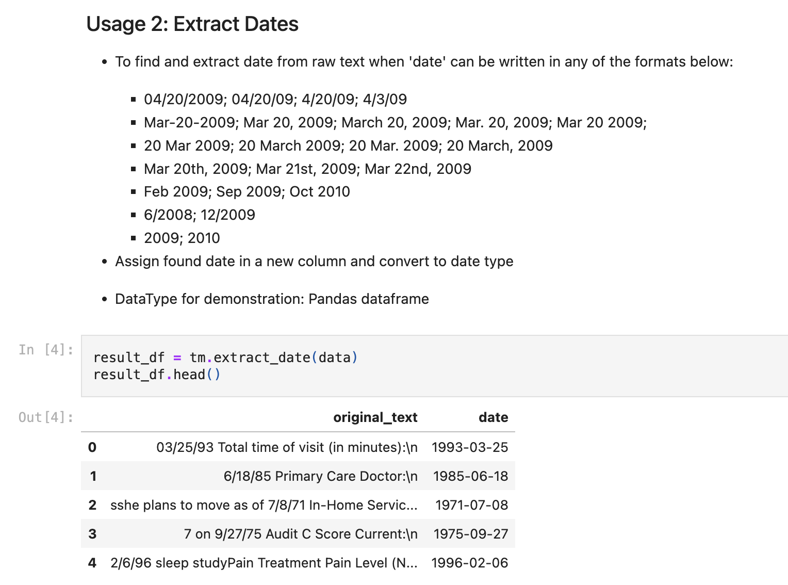

# NLP Projects 

This repo contains common NLP projects such as the following:
* Sentiment Classification 
* Topic Modeling
* Common text mining such as: 
    - Extracting dates (in various formats) out of raw text

## text_mining Module 

### Description: ### 
The text_mining module is a Python package developed as part of this repository. It provides functionalities for text analysis and mining tasks

### Features: ### 
**Average Length Calculation:** The module includes a method to compute the average length of text data in a pandas DataFrame or Series.

**Extract_date:** Extracts dates in various formats from text data using regular expressions. 

### Notebooks 
Demonstrations and examples of how to use the `textMining` class can be found in the accompanying Jupyter notebook (`text_mining_demo.ipynb`). The notebook showcases various use cases, including text analysis and date extraction tasks, using both DataFrame and Series inputs. 

Please refer to the notebook for detailed explanations and step-by-step instructions on how to utilize the `textMining` class in your projects.

